## Agenda

- Introduction
- Gadgets and Ideas
- Tools and Utilities
- Tinkering

# Introduction

## Hello, I am Daniel :-)

:::::::::::::: {.columns}
::: {.column width="42%"}
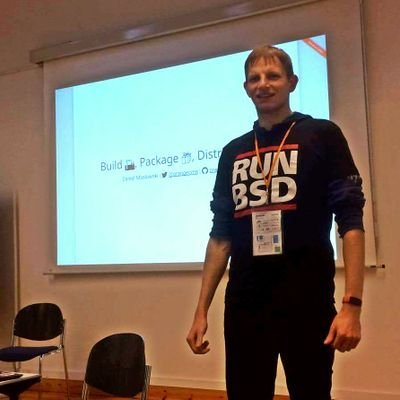{ width=100% }
:::
::: {.column width="58%"}
### Work and education
- IT security and computer science
- software engineer
- infrastructure and web
- apps, UIs, ecommerce

### Open Source contributions
- hardware and firmware
- operating systems
- software distributions
- reverse engineering
:::
::::::::::::::

# Gadgets and Ideas

## Wireless Storages

### ... are just networked devices with storage

:::::::::::::: {.columns}
::: {.column width="42%"}
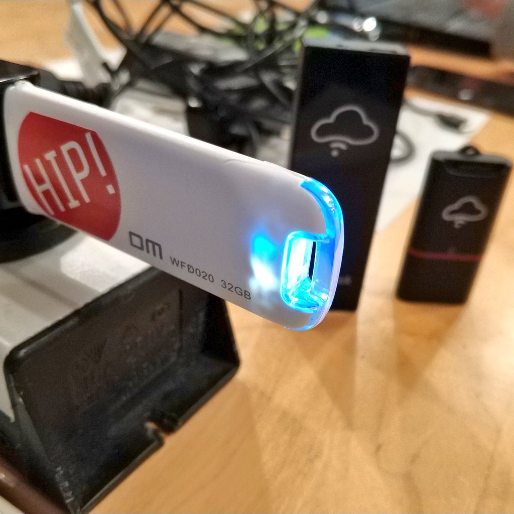{ height=80% }
:::
::: {.column width="58%"}
### old ideas
- MCU running a small application, sometimes RTOS
- SoC, Arm or MIPS, running Linux
- built-in SD card reader

### new ideas
- access point for devices in your NoT (Network of Things)
- MQTT broker for controlling things, e.g., via SUSI AI
:::
::::::::::::::

## Network Video Recorders (NVRs)

:::::::::::::: {.columns}
::: {.column width="52%"}
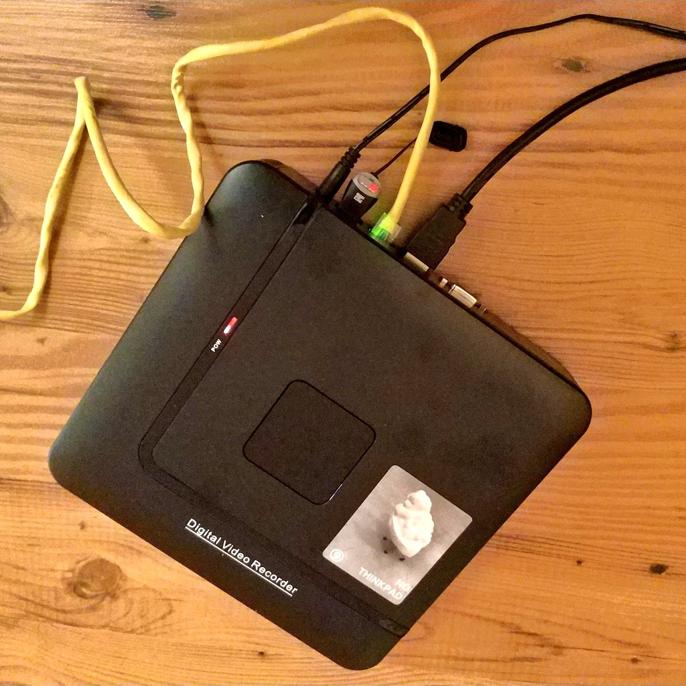{ height=80% }
:::
::: {.column width="48%"}
### old ideas
- essentially storage with more connectors
  * USB, HDMI, ethernet
  * built-in network switch
  * analog video input
- SoC, mostly Arm, running Linux

### new ideas
- little general purpose computer with web browser
- home theatre / movie player
:::
::::::::::::::

## IP cameras

Essentially, these are just camera sensors attached to some SoC that is
running Linux, with Wi-Fi and/or ethernet modules and often SD card
readers.

:::::::::::::: {.columns}
::: {.column width="40%"}
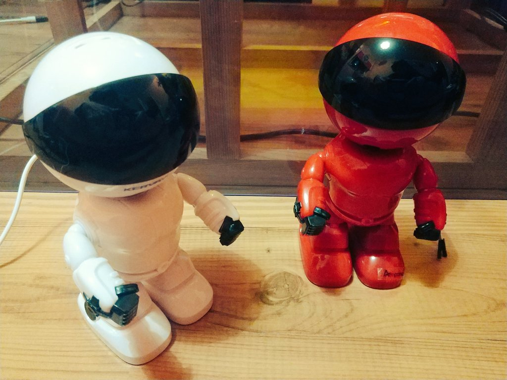{ height=85% }
:::
::: {.column width="30%"}
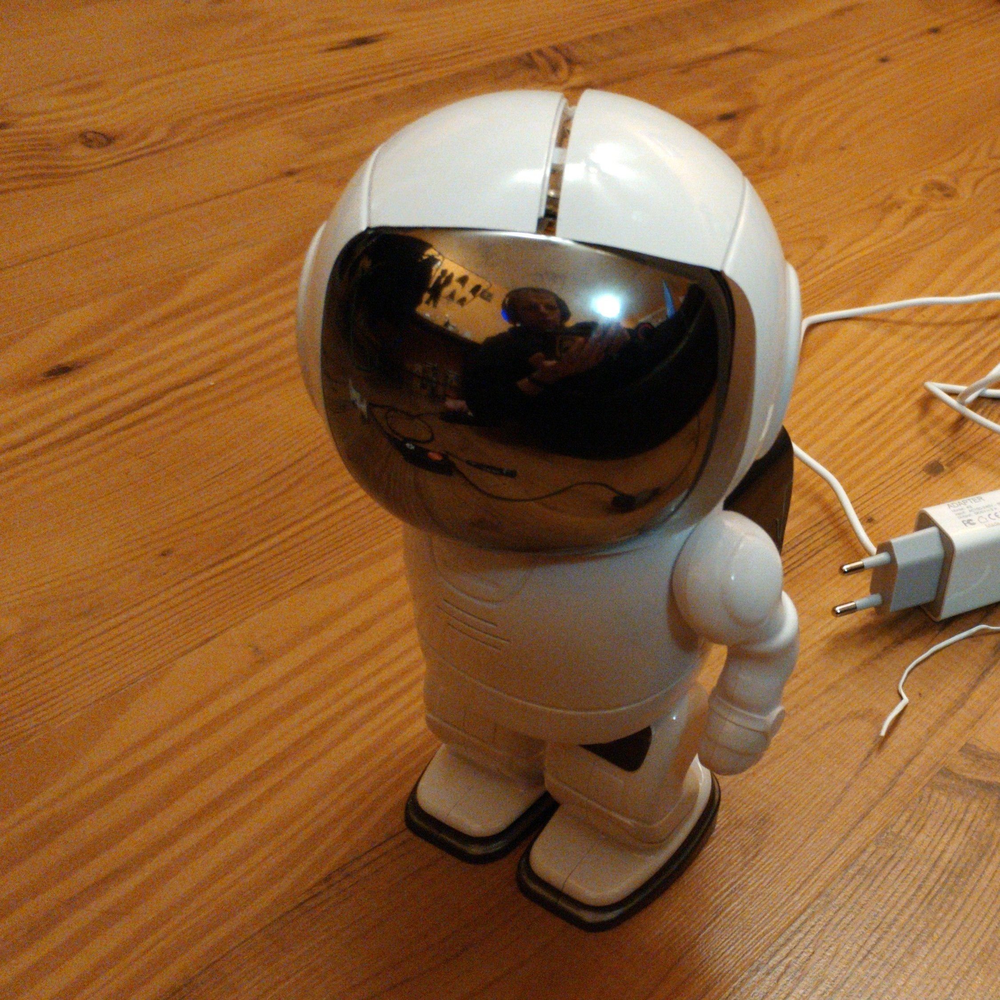{ height=85% }
:::
::: {.column width="30%"}
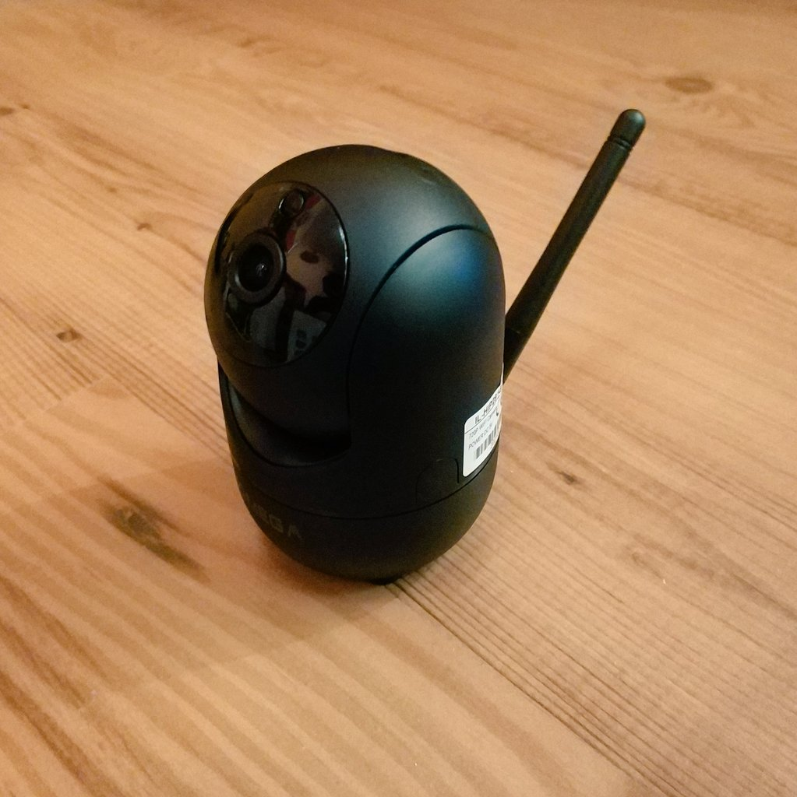{ height=85% }
:::
::::::::::::::

They typically feature two motors to rotate and tilt, sometimes a
speaker and a microphone for two-way audio communication.

OpenIPC project - [https://openipc.org/](https://openipc.org/)

# Tools and Utilities

## Hardware

:::::::::::::: {.columns}
::: {.column width="42%"}
- network cables and switch
- wireless access point
- SPI flash programmer
- USB serial converter
- dupont wires and probes
- soldering equipment
- screwdrivers
:::
::: {.column width="58%"}
{ height=80% }
:::
::::::::::::::

## u-root

A universal root filesystem

:::::::::::::: {.columns}
::: {.column width="42%"}
{ height=72% }
:::
::: {.column width="58%"}
- many small tools
- all open, meant for studying and understanding
- easily portable
- written in Go

:::
::::::::::::::

[https://u-root.org/](https://u-root.org/)

## u-root Graphics

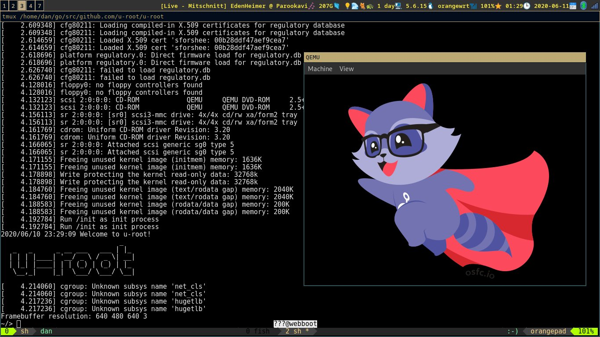

## centre

- DHCP
- SFTP
- simple binary, written in Go
- easy to run on your laptop

[https://github.com/Harvey-OS/go/tree/main/cmd/centre](
https://github.com/Harvey-OS/go/tree/main/cmd/centre)

# Tinkering

## IP Camera Teardown

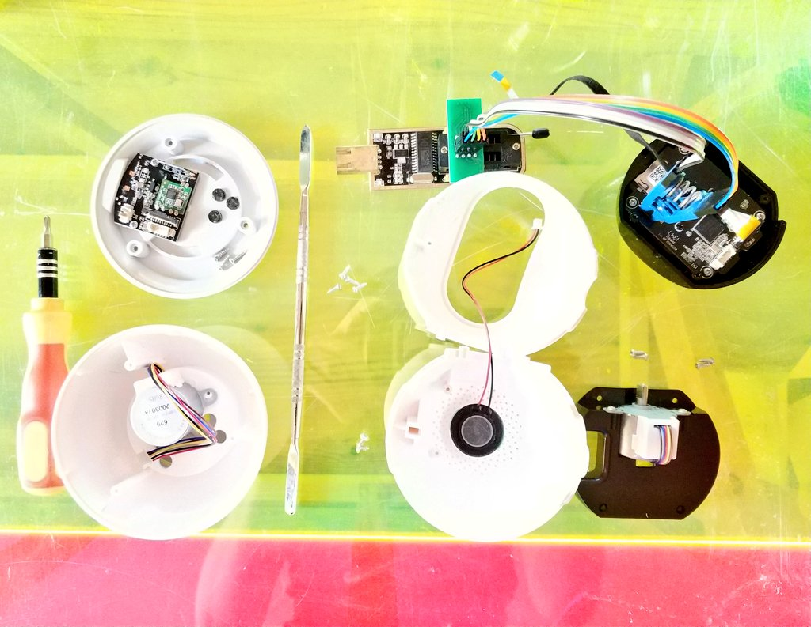{ height=82% }

## NVRs from inside

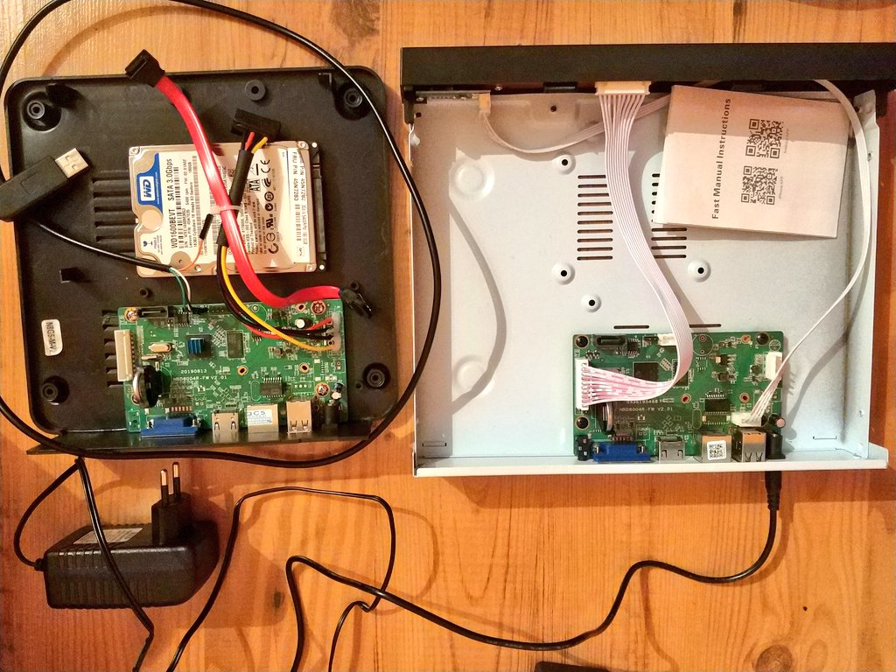{ height=82% }

## PSLab as a Logic Analyzer

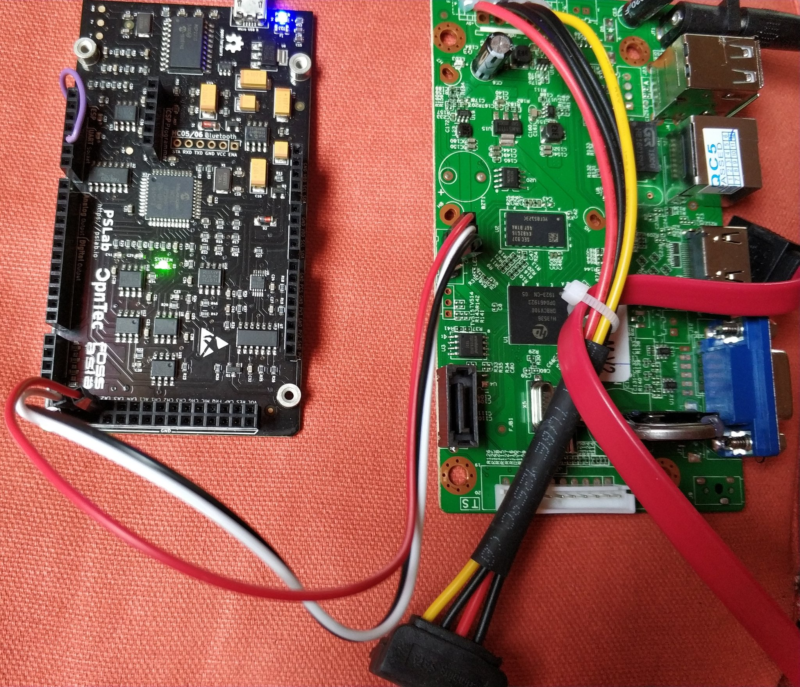{ height=82% }

## Adding Missing Components

:::::::::::::: {.columns}
::: {.column width="52%"}
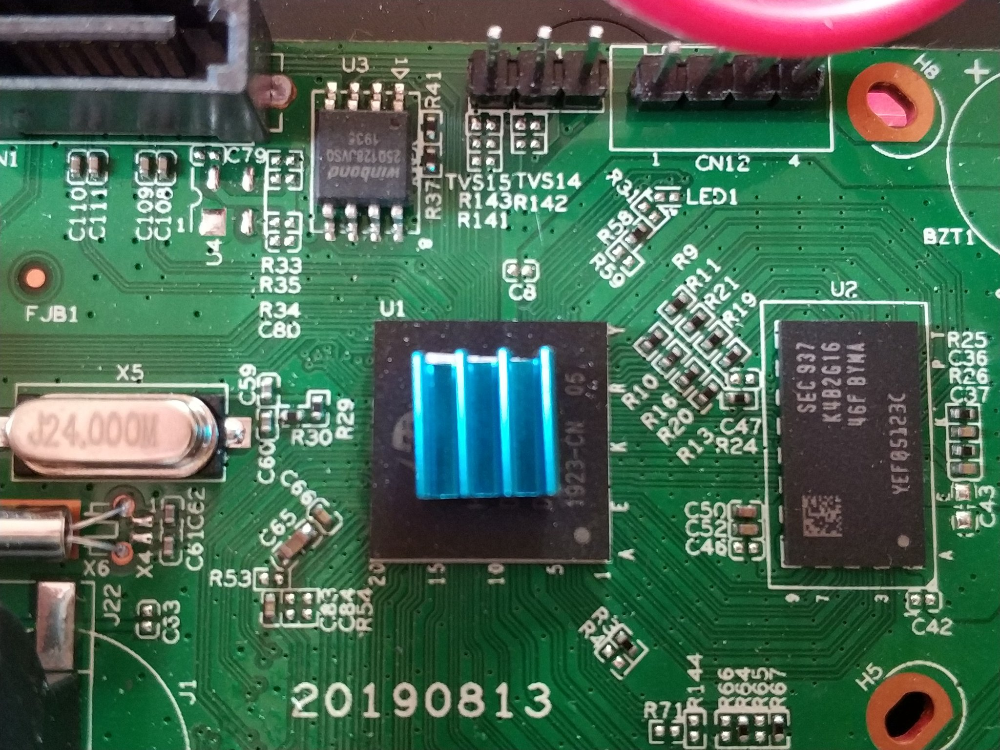
:::
::: {.column width="48%"}
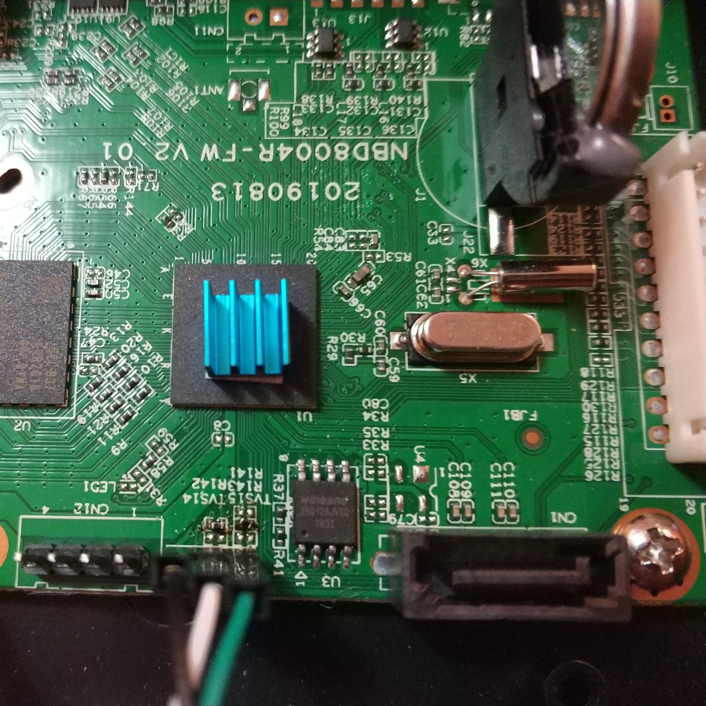
:::
::::::::::::::

## u-root on a Wireless Storage

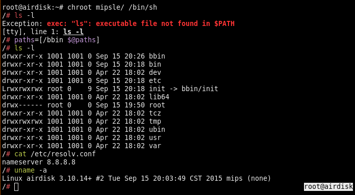

## u-root on an NVR

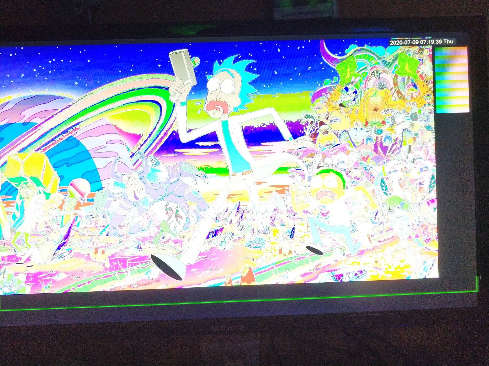{ height=82% }

# Thanks! Questions?

# Extras

## Fun

[astronaut protocol](
https://twitter.com/OrangeCMS/status/1347752470148247558)

[SanDisk Media Drive disco](
https://twitter.com/OrangeCMS/status/1257406373651976195)

